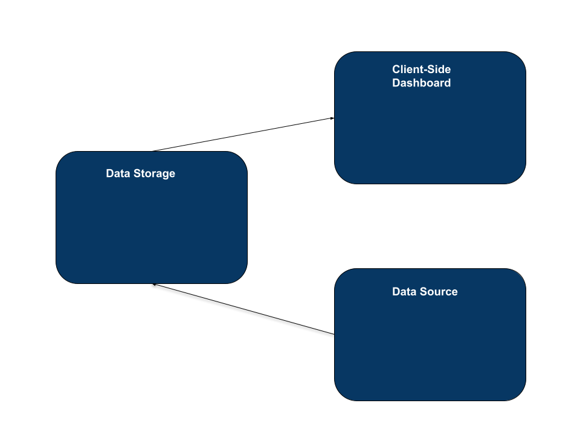
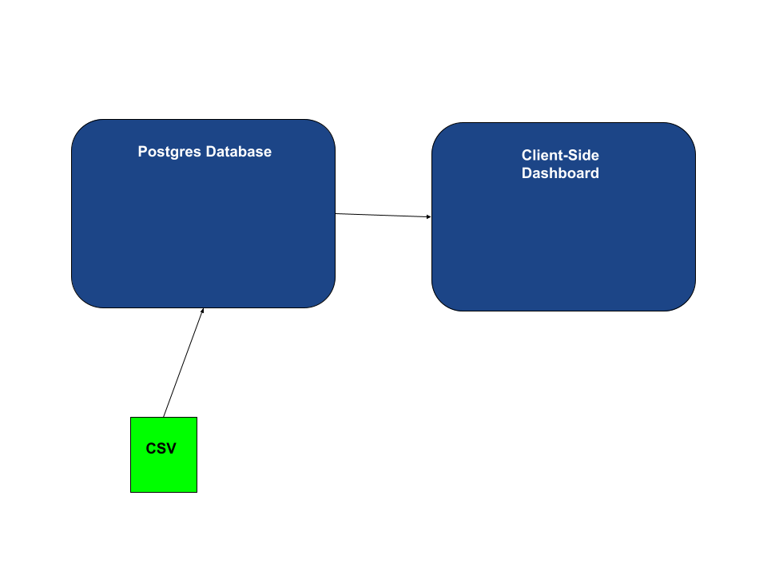
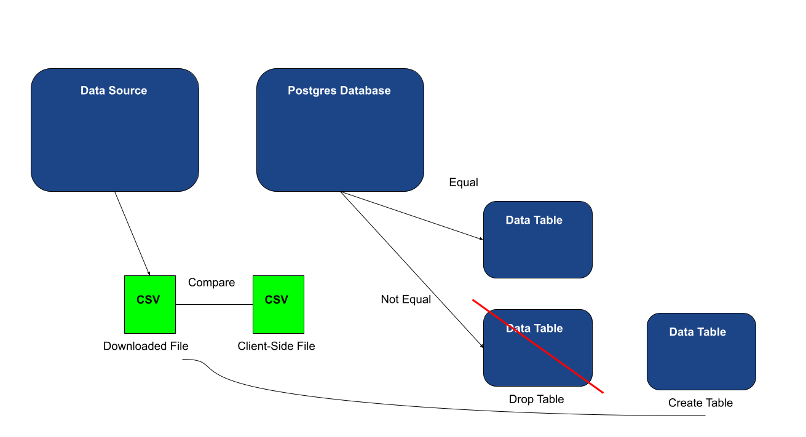
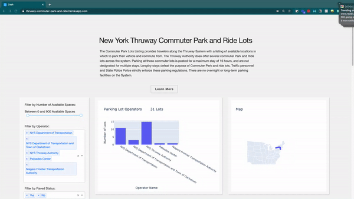

# New York Thruway Commuter Park and Ride Lots Case Study

## Motivation

The Commuter Park Lots Listing provides travelers along the Thruway System with a listing of available locations in which to park their vehicle and commute from. The Thruway Authority does offer several commuter Park and Ride lots across the system. Parking at these commuter lots is posted for a maximum stay of 16 hours, and are not designated for multiple stays. Lengthy stays defeat the purpose of Commuter Park and ride lots. Traffic personnel and State Police Police strictly enforce these parking regulations. There are no overnight or long-term parking facilities on the System.

Issue → Clients are looking to gain insight into the economic activity of the particular areas where public transportation is available and have a keen interest in the corresponding real estate markets.

Task → Develop an implementation plan to on-board New York Park & Ride Facilities into a database and make it available to clients through a client-facing dashboard.

## Project Architecture

## Client-Side Dashboard

Since we are tasked with creating a client-side dashboard, we need to be able to allow the client to interact with the data in a way that is meaningful for them. We are able to provide insights to clients regarding each individual commuter park and parking lot. The client can filter through various parameters that can get them more familiar with the relationship and differences between data points.

Built using the following technologies

[Plotly Dash](https://dash.plot.ly/)  →  Used to easily implement a web interface and the create dashboard.

[Postgres](https://www.postgresql.org/)  → Used relational database to storage data and feed into the client-side dashboard.

## Data Acquisition and Storage

Before data acquisition began a database was created on cloud-platform Heroku for data storage. A downloaded csv file of the data is then piped into the database as a table. It is connected with the production environment also on Heroku. The client-side plotly dash application would read from the Postgres database to grab and process the data into the visual dashboard.

## Updating our Data

A script (update_tble.py) is implemented to extract the data from the data.gov source using an API call. The new data is downloaded and used to compare against the original data file we used to create our initial table. If any changes are detected then the database drops the outdated table and a new table is created with the new data. 

## Design Considerations

**How to would this application scale? What if the data downloaded contained suddenly thousands of rows?**

→ The initial design will not be the most efficient method, if the dataset were extremely large. However, this design was considered because the dataset was relatively small, with less than 100 rows. Initial design requires completely dropping the table when there is any change in the files and creating another table containing the new data. A solution would be to detect the specific rows in the data that are new and append them to the existing table.

→ Currently, our script will perform a check on the data each time a client visits the dashboard. This would be overwhelming if the application were being accessed my many users, causing many requests to the data.dov source. A solution to handle this could be to use the date of the file to run a check every 30 days.

## Demo

